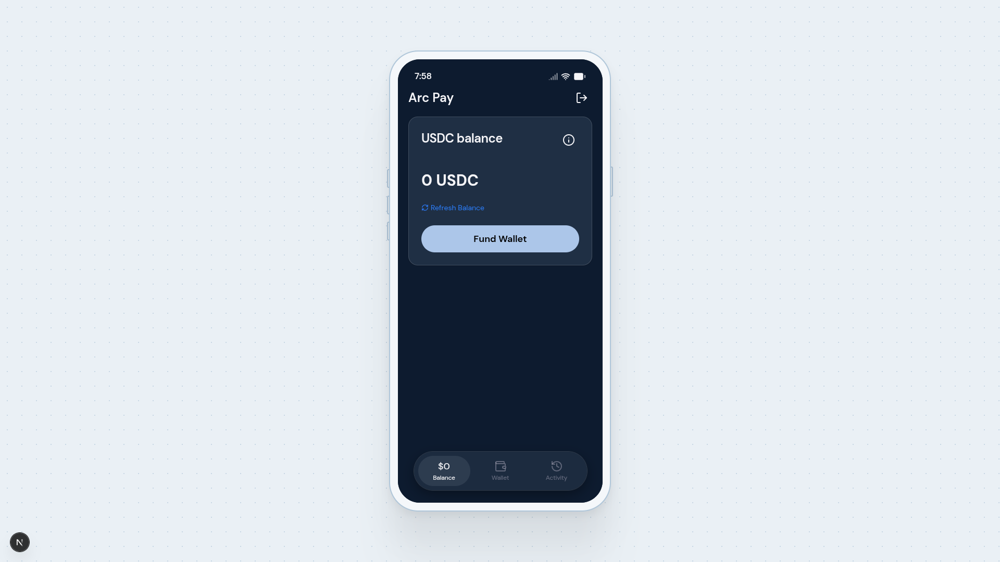

# Arc P2P Payments

Modern peer-to-peer payment system. This sample application uses Next.js, Supabase, and Circle Modular Wallets with Passkey security to demonstrate a seamless, gasless P2P payment system on the Arc Network.



## Table of Contents

- [Prerequisites](#prerequisites)
- [Getting Started](#getting-started)
- [How It Works](#how-it-works)
- [Environment Variables](#environment-variables)
- [User Accounts](#user-accounts)
- [Testing](#testing)
- [Security & Usage Model](#security--usage-model)

## Prerequisites

- **Node.js v22+** — Install via [nvm](https://github.com/nvm-sh/nvm)
- **Registry token** — `@crcl-main/onramp-kit` comes from Circle's private registry (see `.npmrc`). Export the token variable named there before `npm install`, or it fails with `E401`
- **Docker Desktop** — Runs Supabase locally. [Install Docker Desktop](https://www.docker.com/products/docker-desktop/)
- Circle **[API key](https://console.circle.com/signin)** and **[Entity Secret](https://developers.circle.com/wallets/dev-controlled/register-entity-secret)**

## Getting Started

1. Clone the repository and install dependencies:

   ```bash
   git clone git@github.com:akelani-circle/arc-p2p-payments-public.git
   cd arc-p2p-payments-public
   npm install
   ```

2. Set up environment variables:

   ```bash
   cp .env.example .env.local
   ```

   Then edit `.env.local` and fill in all required values (see [Environment Variables](#environment-variables) section below).

3. Start the local Supabase instance (requires Docker Desktop running):

   ```bash
   npx supabase start
   npx supabase migration up
   ```

   The output of `npx supabase start` will display the Supabase URL and API keys needed for your `.env.local`.

4. Start the development server:

   ```bash
   npm run dev
   ```

   The app will be available at `http://localhost:3000`.

## How It Works

- Built with [Next.js](https://nextjs.org/) App Router and [Supabase](https://supabase.com/)
- Uses [Circle Modular Wallets](https://developers.circle.com/wallets/modular) for managing transactions with Passkey security
- Uses [Arc Network](https://arc.network/) for fast and low-cost transactions
- Payments are sent as user operations through a bundler, with gas sponsored by a paymaster
- **Fund Wallet** uses `@crcl-main/onramp-kit`: the server creates a session for the signed-in user's own wallet and the browser opens Circle's onramp widget with it
- Real-time UI updates powered by Supabase Realtime subscriptions
- Styled with [Tailwind CSS](https://tailwindcss.com) and components from [shadcn/ui](https://ui.shadcn.com/)

## Environment Variables

Copy `.env.example` to `.env.local` and fill in the required values:

```bash
# Supabase
NEXT_PUBLIC_SUPABASE_URL=your-project-url
NEXT_PUBLIC_SUPABASE_PUBLISHABLE_KEY=your-publishable-key
SUPABASE_SECRET_KEY=your-secret-key

# Circle
CIRCLE_API_KEY=your-circle-api-key
CIRCLE_ENTITY_SECRET=your-circle-entity-secret
NEXT_PUBLIC_CIRCLE_CLIENT_KEY=your-circle-client-key
NEXT_PUBLIC_CIRCLE_CLIENT_URL=https://modular-sdk.circle.com/v1/rpc/w3s/buidl

# Fund Wallet (Onramp Kit, sandbox)
ONRAMP_API_BASE_URL=https://api-test.circle.com
NEXT_PUBLIC_ONRAMP_WIDGET_BASE_URL=https://onramp-sandbox.arc.io
```

| Variable | Scope | Purpose |
| --- | --- | --- |
| `NEXT_PUBLIC_SUPABASE_URL` | Public | Supabase project URL. |
| `NEXT_PUBLIC_SUPABASE_PUBLISHABLE_KEY` | Public | Supabase publishable key. |
| `SUPABASE_SECRET_KEY` | Server-side | Supabase secret key. Bypasses row level security, so it is only used by server routes with no user session, like the Circle webhook. |
| `CIRCLE_API_KEY` | Server-side | Circle API key for wallet operations and Fund Wallet. |
| `CIRCLE_ENTITY_SECRET` | Server-side | Circle entity secret for signing transactions. |
| `NEXT_PUBLIC_CIRCLE_CLIENT_KEY` | Public | Circle client key for modular wallets. |
| `NEXT_PUBLIC_CIRCLE_CLIENT_URL` | Public | Circle modular wallet SDK RPC URL. |
| `ONRAMP_API_BASE_URL` | Server-side | Circle API endpoint for the onramp. Keep it on sandbox: if unset, the app uses production and purchases charge a real payment method. |
| `NEXT_PUBLIC_ONRAMP_WIDGET_BASE_URL` | Public | Onramp widget origin. Keep it on sandbox for the same reason. |

## User Accounts

### Test Accounts (Local Supabase)

If you are running Supabase locally, you can use the following pre-defined phone numbers and OTPs for testing (configured in `supabase/config.toml`):

| Phone Number | OTP |
| --- | --- |
| `+14152127777` | `123456` |
| `+14152128888` | `654321` |

### Default Account

On first visit, you can also sign up with any email and password, then set up your passkey.

## Testing

- `npm test` runs the unit tests in `tests/unit`. They mock Supabase, Circle and the onramp kit, so they need no credentials, Docker or registry token.
- `npm run test:integration` runs `tests/integration` against the local Supabase stack (row-level security, with real users and sessions).

## Security & Usage Model

This sample application:
- Assumes testnet usage only
- Handles secrets via environment variables
- Checks that a signed-in user owns the wallet before any wallet API acts on it
- Is not intended for production use without modification

## Legal

Sample apps provided for demonstration and educational purposes only, intended for Arc testnet use only, and not production-ready. See [Arc.io](https://arc.io) for more.
